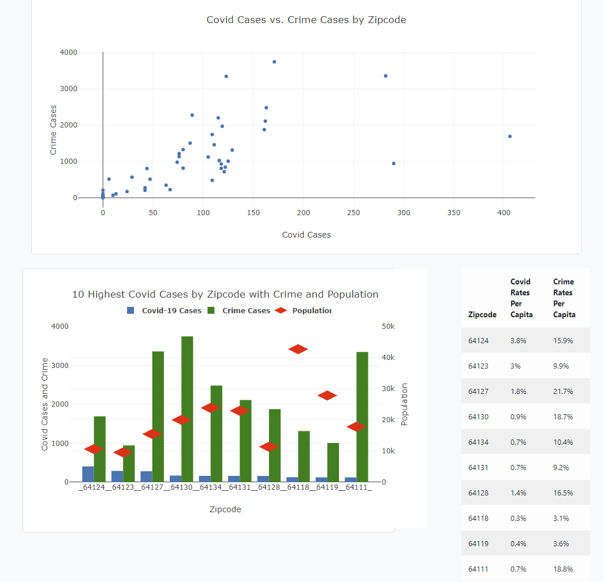

# COVID-19 | Crime | Populations A look at KCMO Zip Codes
#### Project Creaters: Carlee Young, Dylan Obermueller, Jerod Rhodes, and Trevor Guleserian

## Overview:
#### The Mahomies decided to collect data for Kansas City, MO on its COVID-19 cases, crime cases and population per zip code. Using SQLAlchemy, we sourced all of our data and created a SQL dataframe that we could leverage when creating our visualizations. Utilizing Flask 1.0 we created a webpage to house our visual representations of our findings. Performing and API call to our SQLAlchemy database, we read in the data needed to build our scatter and bar charts. 

#### To build the map,  chloropleth.js documentation and geoJSON data of the KCMO zip codes with population and covid cases added (expertly by Dylan and Trevor).  We utilized D3 to add a legend and tooltip for functionality.

## What does the data show us?
#### 1. What is the relationship or correlation between Covid-19 cases and number of crime cases per zip code?
#### 2. What is the relationship or correlation between Covid-19 cases and population per zip code?
#### 3. Is there other data that is contributing to Covid-19 cases and the number of crime cases per zip code?

## Theme:
#### Our goal was to tell a story about KCMO using our visualizations and allowing end users the ability to explore the data and relationships for themselves. We hoped by showing Covid-19, crime, and population together that we might be able to deduce any pattern for the area.

## Coding approach:

### Interactive Dashboard with 3 visualizations:
#### Retrieving data for dashboard
###### Python Flask App
#### Map
###### Leaflet
###### Chloropleth Javascript Plug-in
#### Scatter
###### Plotly Javascript
#### Bar
###### Plotly Javascript Library
###### React Javascript Library

#### 1. 
#### 2. 
#### 3. 

## Data wrangling techniques:

#### 1. Exported CSV data from Open Data KC and the Census Bureau
#### 2. Open Data KC data used to create three data frames for covid, crime and population stats
#### 3. Data frames were deployed using SQLAlchemy to create a SQL Database
#### 4. GeoJSON data used in conjunction with covid and population data added to build choloropleth map. 
#### 5. Used API to pull census data and combined with zip code latitude and longitude to get population by zip code.
#### 6. Utilizing Flask,  did an API call to our SQL database to return a json list to create our visualizations

## Final layout:

